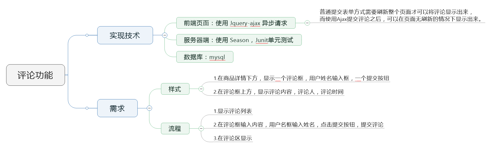
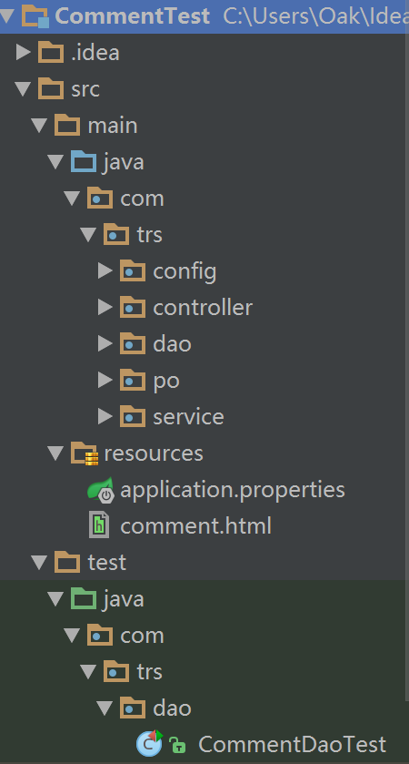

#产品评论功能  
<a id="Top"></a>
##目录  
* [整体概览](#整体概览)  
* [细览页面](#细览页面)
* [服务器端](#服务器端)  


##一、<a id="整体概览">整体概览</a>   

 

* 创建数据库  

```sql
create table t_trscomment(
id int(10) primary key,
name varchar(10),
content varchar(220),
product_id varchar(10),
time timestamp not null DEFAULT current_timestamp
);
```  
* 工程目录  

  

##二、<a id="细览页面">细览页面</a>  

```html
<!DOCTYPE html>
<html lang="en">
<head>
    <meta charset="UTF-8">
    <title>产品详情</title>
    <link href="http://ajax.googleapis.com/ajax/libs/jqueryui/1.8/themes/base/jquery-ui.css" rel="stylesheet" type="text/css"/>
    <script src="http://ajax.googleapis.com/ajax/libs/jquery/1.4/jquery.min.js"></script>
    <script src="http://ajax.googleapis.com/ajax/libs/jqueryui/1.8/jquery-ui.min.js"></script>

    <script>

        <!-- 初始化评论列表 -->
        $(function() {

            var productId = $("#product_id").val();
            $.ajax({
                type:"get",
                dataType:"json",
                url:"http://localhost:8080/sunmwcm/comment/getComments",
                data: {
                    productId:productId
                },
                success: function(data){

                    var commentsHTML = "";
                    $.each(data.comments, function(commentIndex, comment){
                        commentsHTML += "<li>" +
                                "<div>"+"用户："+"<p>"+comment.name+"</p>"+"</div>"+
                                "<div>"+"评论内容："+"<p>"+comment.content+"</p>"+"</div>"+
                                "<div>"+"评论时间："+"<p>"+comment.time+"</p>"+"</div>"+
                                "</li>"
                    });
                    $(".comments").append(commentsHTML);
                }
            });
        });

        <!-- 异步加载评论 -->
        $("#comment_form").submit(function(){

            var name = $("#comment_name").val();
            var content = $("#content_id").val();
            var productId = $("#product_id").val();
            $.ajax({
                type:"post",
                dataType:"json",
                url:"http://localhost:8080/sunmwcm/comment/addComment",
                data: {
                    name:name,
                    content:content,
                    productId:productId
                },
                success: function(data){

                    var newcomment = "<li>" +
                            "<div>"+"用户："+"<p>"+data.name+"</p>"+"</div>"+
                            "<div>"+"评论内容："+"<p>"+data.content+"</p>"+"</div>"+
                            "<div>"+"评论时间："+"<p>"+data.time+"</p>"+"</div>"+
                            "</li>"
                    $(".comments").append(newcomment);
                }
            });
            return false;
        });
    </script>

</head>
<body>

    <div id="product">
        <!--产品显示-->
        <TRS_COLUMN id=DOCHTMLCON>
            产品详情显示
        </TRS_COLUMN>
    </div>

    <div id="comment">
        <!-- 评论区 -->
        <ul class = "comments">
        </ul>
    </div>

    <form id="comment_form" method = "post">
        <!-- 隐藏域 -->
        <input id="product_id" type="hidden" value= "<TRS_COLUMN id=DOCTITLE>产品标题</TRS_COLUMN> "/>
        用户名：<input id="comment_name" type="text" name="name" /></br>
        评论内容：<textarea cols="60" id="content_id" rows="10"></textarea></br>
        <input type="submit" value = "评论" />
    </form>

</body>
</html>
```  

##三、<a id="服务器端">服务器端</a>  

###1.依赖包  

```xml
<?xml version="1.0" encoding="UTF-8"?>
<project xmlns="http://maven.apache.org/POM/4.0.0"
         xmlns:xsi="http://www.w3.org/2001/XMLSchema-instance"
         xsi:schemaLocation="http://maven.apache.org/POM/4.0.0 http://maven.apache.org/xsd/maven-4.0.0.xsd">
    <modelVersion>4.0.0</modelVersion>

    <groupId>trs.com.cn</groupId>
    <artifactId>comment-test</artifactId>
    <version>1.0-SNAPSHOT</version>

    <!--添加打包格式-->
    <packaging>war</packaging>

    <!--添加season的支持-->
    <parent>
        <artifactId>season-parent</artifactId>
        <groupId>trs.com.cn</groupId>
        <version>1.4-SNAPSHOT</version>
    </parent>

    <dependencies>
        <!--添加season-core的依赖-->
        <dependency>
            <groupId>trs.com.cn</groupId>
            <artifactId>season-core</artifactId>
        </dependency>

        <!--测试模块，包括JUnit、Hamcrest、Mockito-->
        <dependency>
            <groupId>org.springframework.boot</groupId>
            <artifactId>spring-boot-starter-test</artifactId>
            <scope>test</scope>
        </dependency>
    </dependencies>

    <build>
        <finalName>CommentTest</finalName>
        <plugins>
            <!--添加打包插件-->
            <plugin>
                <groupId>org.springframework.boot</groupId>
                <artifactId>spring-boot-maven-plugin</artifactId>
            </plugin>
        </plugins>
    </build>

    <repositories>
        <!--添加海尔maven仓库地址-->
        <repository>
            <id>haier-maven-repository</id>
            <url>http://test.haier.com/nexus/content/groups/public/</url>
        </repository>
    </repositories>

</project>
```  

###2.配置文件  

```xml
season.datasources[0].id=master
season.datasources[0].url=jdbc:mysql://localhost:3306/trscomment?useUnicode=true&characterEncoding=UTF-8&autoReconnect=true&failOverReadOnly=false&zeroDateTimeBehavior=convertToNull
season.datasources[0].username=root
season.datasources[0].password=123
season.datasource.readOnly=false
```

###3.启动类  

```java
package com.trs.config;

import com.season.core.spring.SeasonApplication;
import com.season.core.spring.SeasonRunner;


/**
 * Created by sunmeng on 2016/10/15.
 * 启动类
 */
public class App extends SeasonApplication {

   public static void main(String[] args){

       SeasonRunner.run(App.class);
   }
}
```  

###4.控制器  

```java
package com.trs.controller;

import com.season.core.Controller;
import com.season.core.ControllerKey;
import com.trs.po.Comment;
import com.trs.service.CommentService;
import org.springframework.beans.factory.annotation.Autowired;
import java.text.SimpleDateFormat;
import java.util.Date;
import java.util.List;

/**
 * Created by sunmeng on 2016/10/15.
 * 控制器
 */
@ControllerKey("comment")
public class CommentController extends Controller {

    @Autowired
    private CommentService commentService;

    /**
     * 添加评论
     */
    public void addComment(){

        Comment comment = new Comment();
        String nameGet = getPara("name");
        String contentGet = getPara("content");
        String productId = getPara("productId");

        comment.setName(nameGet);
        comment.setContent(contentGet);
        comment.setProductId(productId);

        // 添加评论是否成功标识
        Boolean flag = commentService.addComment(comment);
        if(flag) {
            setAttr("name",nameGet);
            setAttr("content",contentGet);
            // 评论时间
              SimpleDateFormat sdf = new SimpleDateFormat("yyyy-MM-dd HH:mm:ss");
            String commentTime = sdf.format(new Date( System.currentTimeMillis()));
            setAttr("time",commentTime);
            renderJson();
        }
    }

    /**
     * 获得评论列表
     */
    public void getComments(){

        List<Comment> commentList = commentService.getCommentListByPid(getPara("productId"));
        renderJson("comments",commentList);
    }

}  

```  

###5.服务层  

```java
package com.trs.service;

import com.trs.dao.CommentDao;
import com.trs.po.Comment;
import org.springframework.beans.factory.annotation.Autowired;
import org.springframework.stereotype.Service;
import java.util.List;
/**
 * Created by sunmeng on 2016/10/15.
 * 服务层
 */
@Service
public class CommentService {

    @Autowired
    private CommentDao commentDao;

    /**
     * 添加评论到某id产品
     */
    public boolean addComment(Comment comment){

       Comment commentReturn = commentDao.addComment(comment);

        // 添加失败, 返回false
        if(commentReturn==null)
            return false;
        // 添加成功, 返回true
        return true;
    }

    /**
     * 根据产品id,获得评论列表
     */
    public List<Comment> getCommentListByPid(String pid){

        // 获得产品列表,格式化评论时间
        return commentDao.getCommentListByPid(pid);
    }
}


```  

###6.持久层  

```java
package com.trs.dao;

import com.season.core.db.Dao;
import com.trs.po.Comment;
import org.springframework.stereotype.Repository;
import java.util.List;

/**
 * Created by sunmeng on 2016/10/15.
 */
@Repository
public class CommentDao {

    /**
     * 添加评论
     * @param comment
     */
    public Comment addComment(Comment comment){

        return comment.save();
    }

    /**
     * 评论列表
     * @param pid
     * @return
     */
    public List<Comment> getCommentListByPid(String pid){

        String sql="select * from t_trscomment where product_id=";
        return Dao.find(Comment.class,sql,pid);
    }

}
```

###7.实体类  

```java
package com.trs.po;

import com.season.core.db.Pojo;
import com.season.core.db.annotation.TableInfo;
import com.season.core.db.annotation.Transient;
import java.util.Date;


/**
 * Created by sunmeng on 2016/10/15.
 * 实体类
 */
@TableInfo(tableName = Comment.TABLENAME, pkName = "id")
public class Comment extends Pojo<Comment> {
    @Transient
    public final static String TABLENAME = "t_trscomment";

    @Transient
    public final static Comment me = new Comment();

    // 评论编号
    private Integer id;
    // 评论人
    private String name;
    // 评论内容
    private String content;
    // 产品编号
    private String productId;
    // 评论时间
    private Date time;

    public Comment() {
    }

    public Comment(Integer id,String name, String content, String productId) {
        this.id=id;
        this.name = name;
        this.content = content;
        this.productId = productId;
    }

    @Override
    public String toString() {
        return "Comment{" +
                "id=" + id +
                ", name='" + name + '\'' +
                ", time=" + time +
                ", content='" + content + '\'' +
                ", productId='" + productId + '\'' +
                '}';
    }

    public Integer getId() {
        return id;
    }

    public void setId(Integer id) {
        this.id = id;
    }

    public String getProductId() {
        return productId;
    }

    public void setProductId(String productId) {
        this.productId = productId;
    }

    public String getName() {
        return name;
    }

    public void setName(String name) {
        this.name = name;
    }

    public Date getTime() {
        return time;
    }

    public void setTime(Date time) {
        this.time = time;
    }

    public String getContent() {
        return content;
    }

    public void setContent(String content) {
        this.content = content;
    }
}

```  

###8.单元测试  

```java
package com.trs.dao;

import com.trs.config.App;
import com.trs.po.Comment;
import org.junit.Test;
import org.junit.runner.RunWith;
import org.springframework.boot.test.SpringApplicationConfiguration;
import org.springframework.test.context.junit4.SpringJUnit4ClassRunner;
import java.util.Iterator;
import java.util.List;

/**
 * Created by sunmeng on 2016/10/15.
 */
// 告诉framework怎么运行这个类
@RunWith(SpringJUnit4ClassRunner.class)
// 指定启动类
@SpringApplicationConfiguration(App.class)
public class CommentDaoTest {

    private CommentDao commentDao = new CommentDao();

    /**
     * 测试添加评论
     * @throws Exception
     */
    @Test
    public void addComment() throws Exception {

        Comment comment = new Comment(2,"sun", "write", "20");
        System.out.println(commentDao.addComment(comment));
    }

    /**
     * 测试评论列表
     * @throws Exception
     */
    @Test
    public void getCommentListByPid() throws Exception {

        List<Comment> commentList = commentDao.getCommentListByPid("热火队");

        for (Iterator<Comment> it = commentList.iterator(); it.hasNext();){
            Comment comment = it.next();
            System.out.println(comment.getName()+"---"+comment.getContent());
        }
    }

}
```  


　　　　　　　　　　　　　　　　　　　　　　*持久层单元测试暂时有异常，还在调试中*  

　　　　　　　　　　　　　　　　　　　　　　　　　　　　　　　　　　　　　　　　　　　　　　[返回顶部](#Top)
