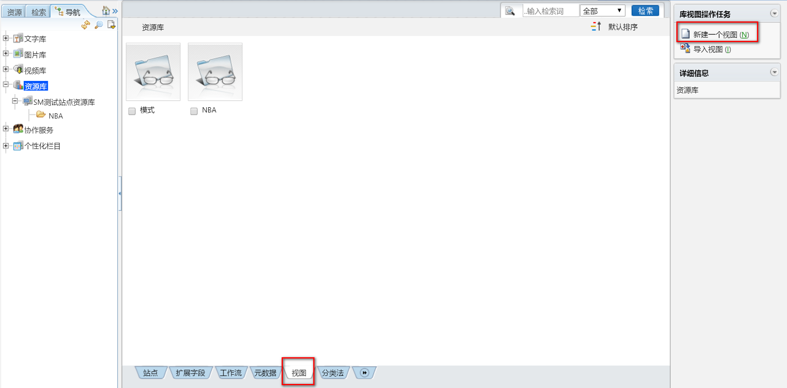

#学习TRS WCM  
<a id="Top"></a>
##目录  
* [基础概念](#基础概念)  
* [搭建产品站点](#搭建产品站点)


##一、<a id="基础概念">基础概念</a>  

###1.TRS WCM  

***是什么？***  

内容协作平台。  

***有什么用？***  

* 提供一套强大的站点建立、管理工具，同时能够实现一定的权限控制和流程控制，保证系统的安全。  

* 页面发布过程中，依靠程序自动结合HTML模板和数据库中的数据，生成最终的HTML页面，同时可以自动生成页面的链接而不用手动干预。  

###2.库
***是什么？***
  
概念：相同类型站点的集合。
  
分类：文字库、图片库、视频库、资源库。  


***有什么用？*** 
 
在库下直接创建站点。

###3.站点  

***是什么？***  

概念：WCM系统里最主要的对象，相当于Internet网站，可以按照网站的结构来设计站点。  

***有什么用？***  

组织和管理栏目。  

***怎么用？***  

库的下一级管理单元。  

* 选择站点：  

  

* 创建站点：  

  

###4.栏目  

***是什么？***  

站点的下一级管理单元，栏目必须依附于站点，没有站点便不能创建栏目。  

***有什么用？***  

组织和管理文档、子栏目。  

***怎么用？***  

* 在站点下创建栏目。  

  


* 在父栏目下创建子栏目。 

* 在栏目定义时，需要指定所使用的模板文件，分别控制概览页面和细览页面的表现。   


###5.文档  

***是什么？***  

概念：WCM系统的基本单元，也是系统的核心数据内容。  

分类：HTML、纯文本、链接、文件。  

***有什么用？***  

显示文字、图片、音频、视频。

***怎么用？***  

* 必须在某个栏目下创建，有特定权限的用户进行操作和管理。 

-创建文档：  

  


-显示文档：  


* 文档只能创建在普通栏目下。  

* 文档在子栏目创建后，需要在文档中设置引用在父栏目，使其在父栏目中显示。  

* 文档必须"发布"，才能被置标引用，在预览站点时，在页面中得到文档的值。

###6.模板  

***是什么？***  

概念：带有TRS置标的HTML文件。  
分类：  
* 概览模板：包括主页模板和各栏目的概览模板。  
  
* 细览模板：各栏目的细览模板。  
  
* 嵌套模板：可嵌套的通用模板。  

***有什么用？***  

用来控制发布页面的显示形式和显示内容，HTML置标控制页面形式，TRS置标控制页面内容。  

***怎么用？***  

分配给站点、栏目、文档使用。 

-创建模板：  

  


###7.视图  

***是什么？***  

存放元数据的几个或全部字段信息。 

***有什么用？***  

在视图中录入资源，然后用置标根据字段名来取值。  

***怎么用？***  

* 创建视图：在视图栏新建一个视图，或者在元数据栏通过元数据生成视图。  

- 视图栏创建视图：  



- 元数据栏创建视图：  

  

  

* 将视图绑定到栏目：视图绑定到栏目上，才能通过置标来取值。  

  

  

* 新建栏目资源：在资源栏目下，选择"新建一条记录"，资源相当于一条数据，需要外部导入，或者手写。  

 

###8.元数据  

***是什么？***  

元数据是描述其它数据的数据，具体说是描述信息资源或数据等对象的数据，或者说是用于提供某种资源的有关信息的结构数据。存放的是一张表。  

***有什么用？***  

生成各种视图。  

***怎么用？***  

* 选择元数据：资源库->元数据。  

   

* 创建元数据：新建一个元数据。  

    

* 显示元数据列表：  

    

* 对元数据进行操作：点击需要操作的元数据，可以进行如下操-生成视图、修改元数据、删除元数据。  

  

* 字段管理：  

-字段列表：在元数据列表区，双击一个元数据图标，进入这个元数据字段管理界面。　　

  

-新建元数据字段  

    

-显示字段：新建一个元数据字段以后，将在元数据对象的物理表中同步新建一个数据库物理字段。  

    

-点击需要操作的字段，可以进行如下操作-修改字段、删除字段。  

    

###9.置标概念  

***是什么？***  

概念：如同HTML置标，和HTML、XML标准兼容。  

分类：  

* 概览置标：表示一个循环的属性，如TRS_DOCUMENTS，TRS_CHANNELS，TRS_RELNEWS。  

* 细览置标：引用某个具体的"数据库"字段，如TRS_DOCUMENT，TRS_CHANNEL。  

* TRS_RECODE  

* TRS_TEMPLATE  

***有什么用？***  

处理数据的内容，存放的位置，以及如何存放。  

***例子***  

```java
<TRS_DOCUMENT FIELD=DOCTITLE autocolor="false">
    
	标题

</TRS_DOCUMEN>
```  

* TRS_DOCUMENT：属于细览置标。  

* FIELD="字段名"属性是必须要设置的，字段可以是WCMDocument(数据字典-文档管理)中的任何字段。  

```java
<TRS_COLUMN id=DOCPUBTIME>

	发布时间

</TRS_COLUMN>
```  
* TRS_COLUMN:细览置标，从WCMDocument表中提取指定字段的字段内容替换当前的置标内。  

* ID=”字段名”属性是必须要设置的，字段可以是WCMDocumet(数据字典-文档管理)中的任何字段。  

```java
<TRS_DOCUMENTS ID="owner" PAGESIZE="16">
       
	[列表信息]

</TRS_DOCUMETS>
```  

* TRS_DOCUMENTS： 概览置标，显示文档列表，顺序与栏目"文档列表"页面一致，显示内容由细览置标 TRS_DOCUMENT 来定义。  

* ID="owner"，ID 表示当前的文档集，owner 表示当前栏目。或者，ID="教育"，"教育"是当前站点存在的栏目名称。

###10.数据字典  

数据字典一般是给开发人员用的，列出了系统后台数据库的情况。 数据库中包含的所有表及其每个字段的类型、对应的中文名称、含义等。  


##二、<a id="搭建产品站点">搭建产品站点</a>  

###1.创建站点  

在文字库下创建站点"sunm产品站点"。  

  


###2.创建模板  

* 在"sunm产品站点"下，选择"模板"菜单，并点击"新建一个模板"。  

   


* 创建概览模板：  

```java
<!DOCTYPE html PUBLIC "-//W3C//DTD XHTML 1.0 Transitional//EN" "http://www.w3.org/TR/xhtml1/DTD/xhtml1-transitional.dtd">
<HTML xmlns="http://www.w3.org/1999/xhtml">
<HEAD>
    <META http-equiv="Content-Type" content="text/html; charset=utf-8" />
    <TITLE>sunm产品站点</TITLE>
</HEAD>
 
<BODY>
 
<TABLE width="100%" height="100%" border="0" cellspacing="0" cellpadding="0">
 
    <TR>
        <TD align="center" valign="middle">
        美国职业篮球联赛
        </TD>
    </TR>
 
    <TR>
 
        <TD align="center" valign="middle">
            <TRS_DOCUMENTS ID="NBA">
                <TABLE width="50%">
                    <TR>
                        <TD align="center" width="50%">
                           
                            <TRS_DOCUMENT FIELD="DOCTITLE" TARGET="_BLANK"/>
                        </TD>
                        <TD align="center" width="50%">
                            <TRS_DATETIME DATEFORMAT="yyyy-MM-dd"/>
                        </TD>
                    </TR>
                </TABLE>
            </TRS_DOCUMENTS>
        </TD>
 
    </TR>
  <TR>
        <TD align="center" valign="middle">
        国际足联世界杯
        </TD>
  </TR>
 
   <TR>
 
        <TD align="center" valign="middle">
            <TRS_DOCUMENTS ID="WorldCup">
                <TABLE width="50%">
                    <TR>
                        <TD align="center" width="50%">

                            <TRS_DOCUMENT FIELD="DOCTITLE" TARGET="_BLANK"/>
                        </TD>
                        <TD align="center" width="50%">
                            <TRS_DATETIME DATEFORMAT="yyyy-MM-dd"/>
                        </TD>
                    </TR>
                </TABLE>
            </TRS_DOCUMENTS>
        </TD>
 
    </TR>
</TABLE>
</BODY>
</HTML>

```  

* 创建细览模板：  

```java
<!DOCTYPE html PUBLIC "-//W3C//DTD XHTML 1.0 Transitional//EN" "http://www.w3.org/TR/xhtml1/DTD/xhtml1-transitional.dtd">
<HTML xmlns="http://www.w3.org/1999/xhtml">
<HEAD>
   <META http-equiv="Content-Type" content="text/html; charset=utf-8" />
   <TITLE>TRS演示站点</TITLE>
   <LINK href="style.css" rel="stylesheet" type="text/css">
 
<!--分页的样式开始-->
<style>
          .clsTRSNavigatorDIV{ 
                    align:center;
                    text-align:center;
                    font-family:tahoma,arial,'bitstream vera sans',helvetica,sans-serif,'宋体'; 
                    font-size:12px; 
                    width:100%; height:100%;
                    overflow:hidden;
                    margin:20px auto;
             padding:20px auto;
                    color:#007FBE;                 
          }
          .clsTRSNavigatorDIV a{
                    text-decoration:none; 
                    text-align:left; 
                    margin:0px 1px; 
                    padding:3px 5px 3px 5px; 
                    height:22px; 
                    background-color:#FCF9EA; 
                    border:1px solid #D6DAD9;
                    color:#007FBE; 
                    line-height:24px; 
                    font-family:"宋体",Arial,Sans;
          }
          .clsTRSNavigatorDIV a:hover{
                    background-color:#017EBE;
                    color:#fff; 
                    text-decoration:none; 
                    border:1px solid #017EBE;}     
 </style>
 <!--分页的样式结束-->
</HEAD>
 
<BODY>
 
<!--~============ TABLE1 ============~-->
<TABLE width="950px" style="margin:0 10%;background-color:#ffffff" align="center">
   <TR>
     <TD>
   
        <!--~============ TABLE2 ============~-->
        <TABLE width="100%" height="4" border="0" cellpadding="0" cellspacing="0" bgcolor="#50a8ac">
          <TR>
             <TD></TD>
          </TR>
        </TABLE>
        <!--~========== END TABLE2 ==========~-->
 
        <BR>
        <BR>
 
        <!--~============ TABLE3 ============~-->
        <TABLE width="100%" style="padding:0px;cellspacing:0px" align="center">
          <TR>
             <TD>
 
                <!--~============ TABLE4 ============~-->
                <TABLE>
                  <TR align="left" style="font-size:14px">
                     <TD WIDTH="3%" valign="top"></TD>
                     <TD WIDTH="97%">
                       当前位置：
                        <TRS_COLUMN id=_TRSCURPAGE>
                       当前位置
                        </TRS_COLUMN>
                     </TD>
                  </TR>
                </TABLE>
                <!--~========== END TABLE4 ==========~-->
 
             </TD>
          </TR>
          <TR>
             <TD width="100%" align="center">
 
                <!--~============ TABLE5 ============~-->
                <TABLE width="90%">
                  <TR class="h1" align="center" vlign="top">
                     <TD align="center">
                        <TRS_DOCUMENT FIELD=DOCTITLE autocolor="false">
                       标题
                        </TRS_DOCUMENT>
                       <BR>
                     </TD>
                  </TR>
                  <TR align="center">
                     <TD align="center" style="padding:10px">
                       <SPAN class="riqi">
                        <TRS_COLUMN id=DOCPUBTIME>
                       发布时间
                        </TRS_COLUMN>
                       </SPAN>
                     </TD>
                  </TR>
                </TABLE>
                <!--~========== END TABLE5 ==========~-->
 
             </TD>
          </TR>
          <TR>
             <TD width="100%" align="center">
 
                <!--~============ TABLE6 ============~-->
                <TABLE width="90%">
                  <TR>
                     <TD>
 
                        <!--~###################### HORIZONTAL RULER ######################~-->
                       <HR color=#009efd SIZE=1>
                     </TD>
                  </TR>
                  <TR class="h2">
                     <TD style="text-align:left">
 
                       <P>
                        <TRS_COLUMN id=DOCHTMLCON>
                       HTML文本
                        </TRS_COLUMN>
                       </P>
                       <BR>
                     </TD>
                  </TR>
                </TABLE>
                <!--~========== END TABLE6 ==========~-->
 
             </TD>
             
          </TR>
          <TR>
          <td height='32' align='center' valign='bottom'>
                <span><strong><a href="#" onclick="window.close();" style="color:black;font-size:10pt">[关闭窗口]</a></strong>
                <span>
                <p/>
             </td>
          </TR>
        </TABLE>
        <!--~========== END TABLE3 ==========~-->
 
     </TD>
   </TR>
</TABLE>
<!--~========== END TABLE1 ==========~-->
 
</BODY>
</HTML>

```  

###3.创建栏目  

* 在站点下创建栏目  

  

 

* 在栏目定义时，需要指定所使用的模板文件，分别控制首页模板和细览模板的表现。  

  

* 在站点上指定首页模板  

  

###4.创建文档  

  

* 填写文档标题、文档类型、文档内容，并保存发布。  

 

 

* 显示文档列表  

  

###5.预览这个站点  

  

* 显示产品列表  

  

* 显示产品详情  

  

项目地址：[http://127.0.0.1:8080/preview/sunmwcm/](http://127.0.0.1:8080/preview/sunmwcm/)  

　　　　　　　　　　　　　　　　　　　　　　　　　　　　　　　　　　　　　　　　　　　　　　　　[返回顶部](#Top)


